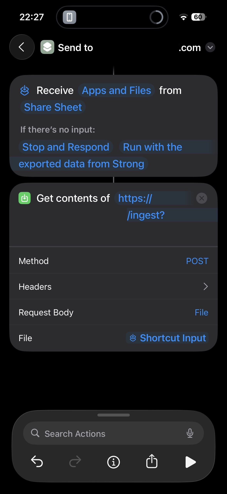

# strong-statistics

Self‑hosted strength‑training analytics for **Strong** app exports. Import your CSV, see PRs, volume trends, rep ranges, and workout history — all stored locally in SQLite.


**🎯 See it in action:** [lifting.dakheera47.com](https://lifting.dakheera47.com) (forgive the low numbers, I just started! 😅)

---

## 🚀 TL;DR (self‑host)

```bash
git clone https://github.com/DaKheera47/strong-statistics.git
cd strong-statistics
cp .env.example .env   # set INGEST_TOKEN to a long random string
docker compose up -d
```

Then open:

* Dashboard → [http://localhost:8069/](http://localhost:8069/)

---

## ⚙️ Configuration (minimal)

Edit `.env` before first run:

| Variable       | Required | Default | What it does                                  |
| -------------- | -------- | ------- | --------------------------------------------- |
| `INGEST_TOKEN` | ✅        | —       | Secret required to upload CSVs via `/ingest`. |

Data is bind‑mounted to `./data` and logs are stored in a named Docker volume by the included `docker-compose.yml`.

---

## 📥 Import your Strong data

1. **Export from Strong** (iOS/Android): Settings → **Export Data** → **CSV**.
2. **Upload to strong-statistics** using your token.

**cURL**

```bash
curl -X POST "http://localhost:8069/ingest?token=$INGEST_TOKEN" \
  -F "file=@/path/to/strong-export.csv"
```

**HTTPie**

```bash
http -f POST :8069/ingest?token=$INGEST_TOKEN file@/path/to/strong-export.csv
```

**Expected response**

```json
{
  "stored": "strong_20240914_123456.csv",
  "rows": 1230
}
```

> Safe to re‑upload newer exports — duplicates are ignored.

---

## 📱 iOS Shortcut: one‑tap export → ingest

**Goal:** export from the Strong app, the iOS share sheet pops up, you tap a shortcut, and it POSTs the CSV straight to your server.



### A) Create the shortcut (one‑time)

1. Open **Shortcuts** on iOS → tap **+** to create a new shortcut.
2. Name it **“Send to strong‑statistics”**.
3. Tap the **info (ⓘ)** button → enable **Show in Share Sheet** → under **Accepts**, select **Files** (CSV).
4. Add action **Get Contents of URL**:

   * **URL:** `http://YOUR_DOMAIN:8069/ingest?token=<TOKEN>`

     > Replace `YOUR_DOMAIN` and `<TOKEN>` with your real domain and **INGEST\_TOKEN**.
   * **Method:** `POST`
   * **Request Body:** `Form`
   * Add form field: **Name** `file` → **Type** `File` → **Value** **Shortcut Input** (a.k.a. Provided Input)
   * (Optional) If you prefer header auth instead of query: set **Headers** → `X-Token: <your INGEST_TOKEN>` and remove `?token=...` from the URL.
5. (Optional) Add **Show Result** to see the JSON response after upload.

> If you don’t see the shortcut in the share sheet later, scroll to the bottom → **Edit Actions** → enable it.

### B) Use it every time

1. In **Strong**: **Settings → Export Data**.
2. The **share sheet** opens automatically → select **Send to strong‑statistics**.
3. Wait a moment; you’ll get a success response. Open your dashboard to see new data.

**Tip:** Large exports can take a few seconds; you can re‑run later — duplicates are skipped.

---

---

## 📊 Using the dashboard

The dashboard provides several analytics widgets in collapsible sections:

* **Recent Workouts** - List of recent training sessions with details
* **Progressive Overload Widget** - Track strength progression over time
* **Session Volume Trend** - Visualize total training volume trends
* **Volume Sparklines** - Per-exercise volume trends in compact charts
* **Max Weight Sparklines** - Track maximum weights over time per exercise
* **Rep Range Distribution** - Analyze your preferred rep ranges

Navigation:
* Main Dashboard → `/` (all analytics widgets)
* All Workouts → `/workouts` (detailed workout history table)
* Click any workout row to view detailed sets and exercises

### Workout detail example


---

## 🐳 Docker Architecture

The application runs as three containers orchestrated by Docker Compose:

* **`api`** (FastAPI backend) - Handles CSV ingestion, data processing, and serves favicon/health endpoints
  - Built from `Dockerfile.api` (Python 3.12-slim)
  - Exposes port 8000 internally
  - Health checks via `/health` endpoint
  - Data directory bind-mounted to `./data`
  - Logs stored in named volume `strong_logs`

* **`web`** (Next.js frontend) - Analytics dashboard and workout viewer
  - Built from `frontend/Dockerfile.web` (Node.js 22-alpine with pnpm)
  - Exposes port 3000 internally
  - Read-only access to SQLite database via bind-mounted `./data`
  - Built with Turbopack for faster builds

* **`proxy`** (Caddy reverse proxy) - Routes traffic between frontend and backend
  - Routes `/ingest*` and `/health` to API backend
  - Routes everything else to Next.js frontend
  - Single external port 8069 for all traffic
  - Configured via `Caddyfile`

**Data persistence:**
- SQLite database and uploads: `./data` directory (bind-mounted to host)
- Application logs: `strong_logs` named Docker volume

---

## 🔌 API endpoints

**Backend (FastAPI):**
* `GET /health` → Health check with last ingested timestamp
* `POST /ingest?token=<TOKEN>` → Upload Strong CSV export (requires token)
* `GET /favicon.svg` → App icon
* `GET /favicon.ico` → App icon (fallback)
* `GET /apple-touch-icon.png` → iOS home screen icon

**Frontend API routes:** (Next.js API routes)
* `GET /api/recent-workouts` → Recent workout list
* `GET /api/recent-workouts?date=YYYY-MM-DD&workout_name=...` → Specific workout details

> Frontend queries SQLite directly for analytics data via server-side API routes.

---

## 🔒 Quick security note

* Keep `INGEST_TOKEN` secret. Don’t post it in screenshots.

---

## ♻️ Update the app

From the repo root:

```bash
git pull
docker compose up -d --build
```

---

## 🧪 Troubleshooting

* **Can't reach dashboard** → Make sure you're using port 8069 (not 8000)
* **401 on `/ingest`** → Missing/incorrect `?token=` or `X-Token` header
* **400 on `/ingest`** → Wrong form field (must be `file`) or not a Strong CSV export
* **500 on `/ingest`** → Check Docker logs: `docker compose logs api`
* **Database errors** → SQLite database issues, check file permissions in `./data`
* **Container startup issues** → Run `docker compose up` (without `-d`) to see logs
* **Frontend won't load** → Check if all containers are healthy: `docker compose ps`

---

## 📝 License

MIT.

---

## 📫 Contact

- **Discord:** `dakheera47`
- **Email:** [shaheer30sarfaraz@gmail.com](mailto\:shaheer30sarfaraz@gmail.com)
- **Website:** [https://dakheera47.com](https://dakheera47.com)
